# 3420 Assignment #4 - Winter 2023

Name(s): Darren Staton Dsilva

Live Loki link(s):
https://loki.trentu.ca/~darrenstatondsilva/3420/assignments/assn4/index.php
https://loki.trentu.ca/~darrenstatondsilva/3420/assignments/assn4/bookdetails.php
https://loki.trentu.ca/~darrenstatondsilva/3420/assignments/assn4/register.php
https://loki.trentu.ca/~darrenstatondsilva/3420/assignments/assn4/login.php
https://loki.trentu.ca/~darrenstatondsilva/3420/assignments/assn4/forget.php
https://loki.trentu.ca/~darrenstatondsilva/3420/assignments/assn4/search.php
https://loki.trentu.ca/~darrenstatondsilva/3420/assignments/assn4/addbook.php
https://loki.trentu.ca/~darrenstatondsilva/3420/assignments/assn4/bookedited.php
https://loki.trentu.ca/~darrenstatondsilva/3420/assignments/assn4/bookadded.php
https://loki.trentu.ca/~darrenstatondsilva/3420/assignments/assn4/deletebook.php
https://loki.trentu.ca/~darrenstatondsilva/3420/assignments/assn4/deleteaccount.php
https://loki.trentu.ca/~darrenstatondsilva/3420/assignments/assn4/editbook.php
https://loki.trentu.ca/~darrenstatondsilva/3420/assignments/assn4/editaccount.php
https://loki.trentu.ca/~darrenstatondsilva/3420/assignments/assn4/logout.php
https://loki.trentu.ca/~darrenstatondsilva/3420/assignments/assn4/accountedited.php
https://loki.trentu.ca/~darrenstatondsilva/3420/assignments/assn4/usernamexist.php

## Rubric

| Component                                                    | Grade |
| :----------------------------------------------------------- | ----: |
| Add Book Validation                                           |    /5 |
| Create Account Validation                                     |    /5 |
| Delete confirmation                                            |    /3 |
| Details modal                                                 |    /3 |
|                                                               |       |
| *Collapsible Nav                                              |    /3 |
| Unique Username                                               |    /3 |
| Password Strength                                             |    /3 |
| *Show Password                                                |    /3 |
| *Summary Limit                                                |    /3 |
| Star Rating                                                   |    /3 |
|                                                               |       |
| Code Quality (tidyness, validity, efficiency, etc)             |    /4 |
| Documentation                                                 |    /3 |
| Testing                                                       |    /3 |
|                                                               |       |
| Bonus                                                         |    /2 |
| Deductions (readability, submission guidelines, originality)  |       |
|                                                               |       |
| Total                                                         |   /35 |

## Table of Contents

## Things to consider for Bonus Marks (if any)

## Code & Testing

Put your code and screenshots here, with proper heading organization. You don't need to include html/php code (or testing) for any pages that aren't affected by your javascript for this assignment.

# Testing was done on Chrome and Safari.

### Register Valdiation
```js
document.addEventListener("DOMContentLoaded", () => {
const registerform = document.getElementById("registerform");
const Name = document.getElementById("name");
const username = document.getElementById("username");
const email = document.getElementById("email");
const password = document.getElementById("password");
const confirmpassword = document.getElementById("cpassword");

// create a request object
let request = new XMLHttpRequest();
// set up a callback function
request.addEventListener('load', (ev) => {
    if (request.status != 200) {
        console.log(request);
    }
    else if (request.response == "true") {
        // if the username already exists, call an error and display message
        if (document.getElementById("usernamexist") == null) { 
            username.parentElement.nextElementSibling.insertAdjacentHTML("afterend", "<span id='usernamexist' class='error'>*That user already exists</p>");
        }
    } else {
        // if the username does not exist, do not display error message
        if (document.getElementById("usernamexist") != null) { 
            document.getElementById("usernamexist").remove();
        }
    }
});


// function that removes the hidden class from the error message
showErrorMessage = (element) => {
    element.parentElement.nextElementSibling.classList.remove("hidden");
}

// function that adds the hidden class to the error message
hideErrorMessage = (element) => {
    element.parentElement.nextElementSibling.classList.add("hidden");
}

// add an event listener to the form
registerform.addEventListener("submit", (e) => {

    // check if the username exists
    request.open("GET", "./usernamexist.php?username=" + username.value);
    request.send();

    let errors = 0; // variable to keep track of errors

    // check for errors
    if (Name.value === "" || Name.value == null) {
        errors++;
        showErrorMessage(Name)
    } else hideErrorMessage(Name)

    if (username.value === "" || username.value == null) {
        errors++;
        showErrorMessage(username)
    } else hideErrorMessage(username)

    if (email.value === "" || email.value == null) {
        errors++;
        showErrorMessage(email)
    } else hideErrorMessage(email)

    if (password.value === "" || password.value == null) {
        errors++;
        showErrorMessage(password)
    } else hideErrorMessage(password)

    if (confirmpassword.value === "" || password.value !== confirmpassword.value) {
        errors++;
        showErrorMessage(confirmpassword)
      } else hideErrorMessage(confirmpassword) 

    // if there are errors, prevent the form from submitting
    if (errors > 0) {
        e.preventDefault();
    }
})
})
```
```html
<form id="registerform" name="registerform" action="<?=htmlentities($_SERVER['PHP_SELF']);?>" method="post" autocomplete="off" novalidate>
      <h2>Create Account</h2>
        <div>
          <label for="name">Name:</label>
          <input type="text" placeholder="John Smith" name="name" id="name"/>
        </div>
        <span class="hidden">Please enter your Name!</span>

        <div>
          <label for="username">Username:</label>
          <input type="text" placeholder="johnsmith5" name="username" id="username" minlength="3" maxlength="16" required/>
        </div>
        <span class="hidden">Please create a username!</span>
        
        <div>
            <label for="email">E-Mail:</label>
            <input type="email" placeholder="jsmith789@gmail.com" name="email" id="email" required/>
          </div>
          <span class="hidden">Please enter a valid E-Mail address!</span>

        <div>
            <label for="password">Password:</label>
            <input type="password" placeholder="***********" name="password" id="password" minlength="6" required/>
          </div>
          <span class="hidden">Passwords do not match!</span>

        <div>
            <label for="cpassword">Confirm Password:</label>
            <input type="password" placeholder="***********" name="cpassword" id="cpassword" required/>
        </div>

        <button type="submit" name="submit">Create Account</button>
        
        <div>
            <a href="./login.php">Existing User?</a>
        </div>

        </form>
```
#### Testing
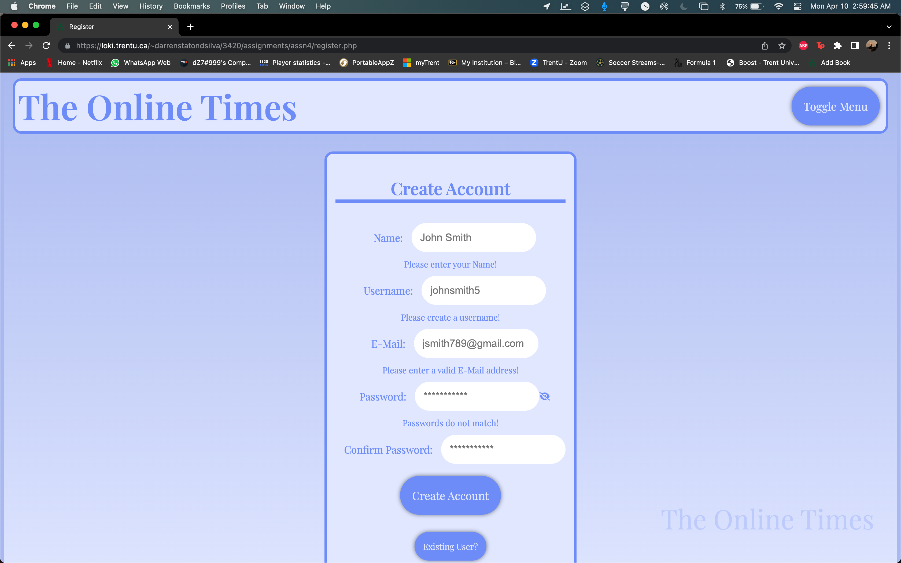
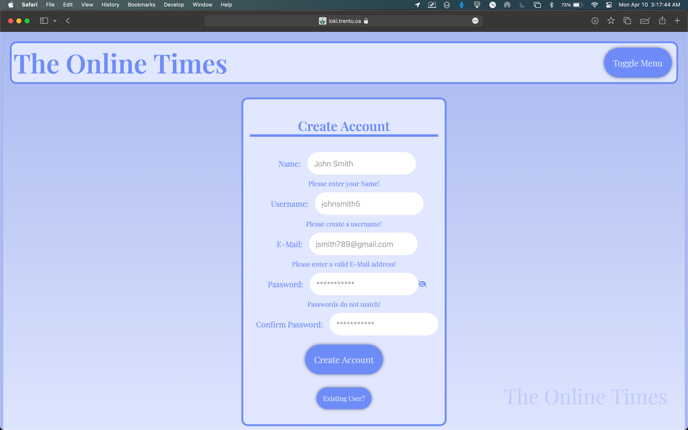


### Book Validation
```js
const addbookform = document.getElementById("addbookform");
const title = document.getElementById("title");
const author = document.getElementById("author");
const rating = document.getElementById("rating");
const genre = document.getElementById("genre");
const isbn = document.getElementById("isbn");
const isbnlength = document.getElementById("isbnlength");
const pdate = document.getElementById("pdate");
const coverimg = document.getElementById("coverimg");
const ebook = document.getElementById("ebook");


// function that removes the hidden class from the error message
showErrorMessage = (element) => {
    element.parentElement.nextElementSibling.classList.remove("hidden");
}

// function that adds the hidden class to the error message
hideErrorMessage = (element) => {
    element.parentElement.nextElementSibling.classList.add("hidden");
}

// add an event listener to the form
addbookform.addEventListener("submit", (e) => {

    let errors = 0; // variable that keeps track of errors

    // check if the fields are empty
    if (title.value === "" || title.value == null) {
        errors++;
        showErrorMessage(title)
    } else hideErrorMessage(title)

    if (author.value === "" || author.value == null) {
        errors++;
        showErrorMessage(author)
    } else hideErrorMessage(author)

    if (rating.value === "" || rating.value == null) {
        errors++;
        showErrorMessage(rating)
    } else hideErrorMessage(rating)
    
    if (genre.value === "" || genre.value == null) {
        errors++;
        showErrorMessage(genre)
    } else hideErrorMessage(genre)

    if (pdate.value === "" || pdate.value == null) {
        errors++;
        showErrorMessage(pdate)
    } else hideErrorMessage(pdate)

    if (isbn.value === "" || isbn.value == null) {
        errors++;
        showErrorMessage(isbn)
    } else if (isbn.value.length != 13) { // check if the isbn is 13 characters long
        errors++;
        isbnlength.classList.remove("hidden");
    } else {
        hideErrorMessage(isbn)
        isbnlength.classList.add("hidden");
    }

    if (coverimg.value === "" || coverimg.value == null) {
        errors++;
        showErrorMessage(coverimg)
    } else hideErrorMessage(coverimg)

    if (ebook.value === "" || ebook.value == null) {
        errors++;
        showErrorMessage(ebook)
    } else hideErrorMessage(ebook)

    // if there are errors, prevent the form from submitting
    if (errors > 0) {
        e.preventDefault();
    }
})
```

```html
 <form id="addbookform" name="addbookform" enctype="multipart/form-data" action="<?=htmlentities($_SERVER['PHP_SELF']);?>" method="post" novalidate>
            <h2>Add a Book</h2>
            <div>
                <label for="title">Title: </label>
                <input type="text" placeholder="The Great Gatsby" name="title" id="title" />
            </div>
                <span class="hidden">Enter a Title!</span>

            <div>
                <label for="author">Author: </label>
                <input type="text" placeholder="F. Scott Fitzgerald" name="author" id="author" />
            </div>
                <span class="hidden">Enter an Author!</span>
            
            <div>
                <label for="rating">Rating (0-10): </label>
                <input type="number" placeholder="4" name="rating" id="rating" min="0" max="9" />
            </div>
                <span class="hidden">Give a rating!</span>

            <div>
                <label for="genre">Genre: </label>
                <input type="text" placeholder="Tragedy" name="genre" id="genre" />
            </div>
                <span class="hidden">Enter a genre!</span>
        
            <div>
                <label for="pdate">Publication Date: </label>
                <input type="date" name="pdate" id="pdate"/>
            </div>
                <span class="hidden">Enter the publication date!</span>

            <div>
                <label for="isbn">ISBN: </label>
                <input type="number" placeholder="9780333791035" name="isbn" id="isbn" required/>
            </div>
                <span class="hidden">Enter an ISBN!</span>
                <span id="isbnlength" class="hidden">Invalid ISBN, should have 13 digits!</span>

            <div>
                <label for="description">Description: </label>
                <textarea name="description" id="description" maxlength="2500" cols="25" rows="10"></textarea>
            </div>
            <span id="count">2500/2500</span>

            <div class="format">
                <label for="format">Book Format:</label>
                    <select name="format" id="book_format">
                    <option value="">Select a format</option>
                    <option value="hardcover">Hardcover</option>
                    <option value="paperback">Paperback</option>
                    <option value="epub">EPub</option>
                    <option value="mobi">Mobi</option>
                    <option value="pdf">PDF</option>
                    <option value="other">Other</option>
                </select>
            </div>

            <div>
                <label for="coverimg">Cover Image: </label>
                <input type="file" name="coverimg" id="coverimg" required/>
            </div>
                <span class="hidden">Please upload a cover image!</span>

            <div>
                <label for="curl">Cover Image URL: </label>
                <input type="url" placeholder="https://upload.wikimedia.org/wikipedia/commons/7/7a/The_Great_Gatsby_Cover_1925_Retouched.jpg"  id="curl" name="curl">
            </div>

            <div>
                <label for="ebook">Ebook Upload: </label>
                <input type="file" name="ebook" id="ebook" />
            </div>
                <span class="hidden">Please upload an ebook!</span>

            <div><button type="reset" name="reset">Start form over</button></div>
            <button type="submit" name="submit">Add Book</button>
              
        </form>
```
#### Testing
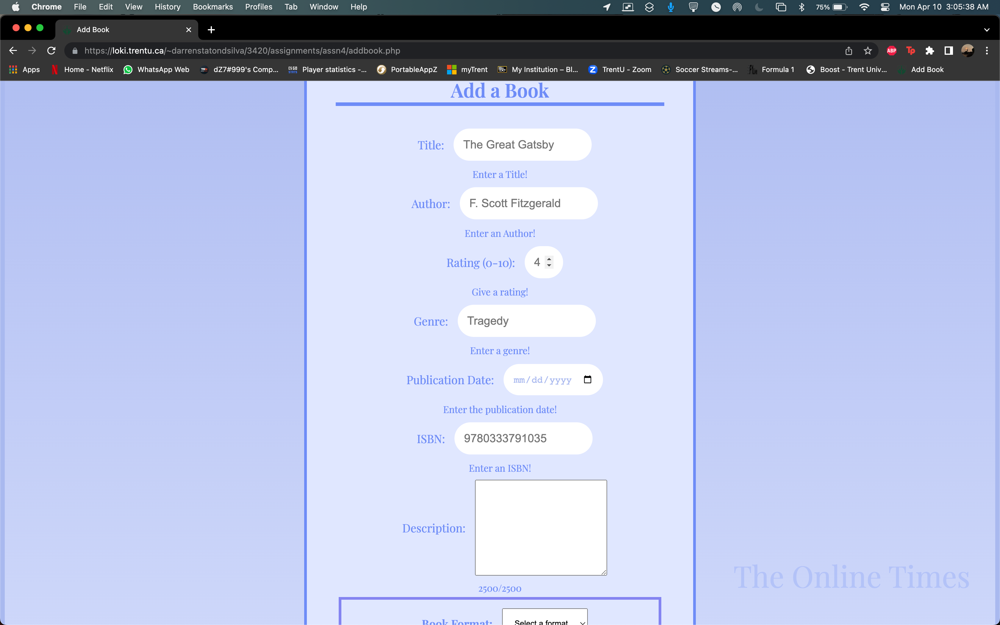
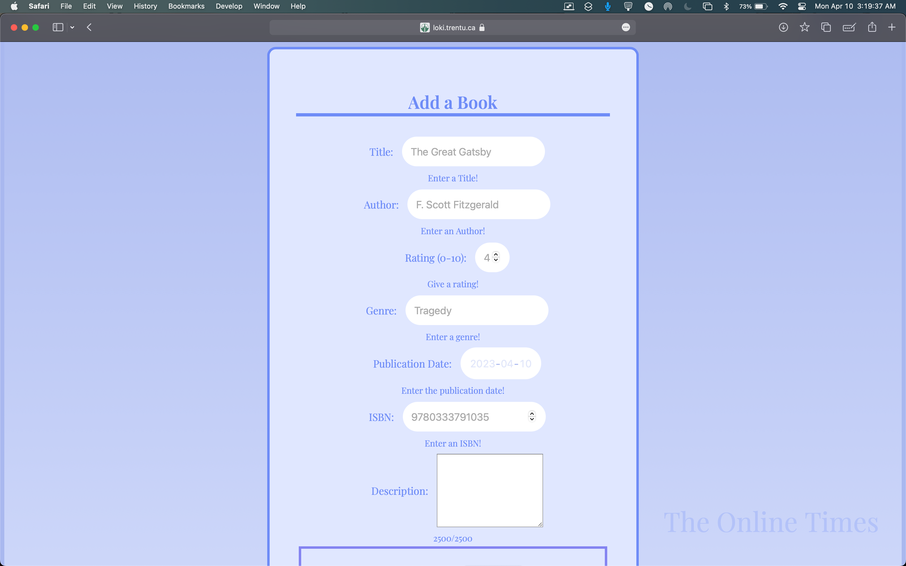

### Confirm Account Deletion 
```js
//function to confirm deleting an account, to prevent from accidental deletion of an account.
//this is done by displaying a window in the browser to confirm deletion.
//after deletion, it will delete the book from the database, and redirect the user to the index page.
function confirmDeleteAcc(){
    if (confirm("Are you sure you want to delete your account?")) {
        window.location = "deleteaccount.php" 
    }
}
```
```html
        <div class="warning">
          <a href="deleteaccount.php" id="cdeleteb" onclick="confirmDeleteAcc()">DELETE ACCOUNT</a>
        </div>
```
#### Testing
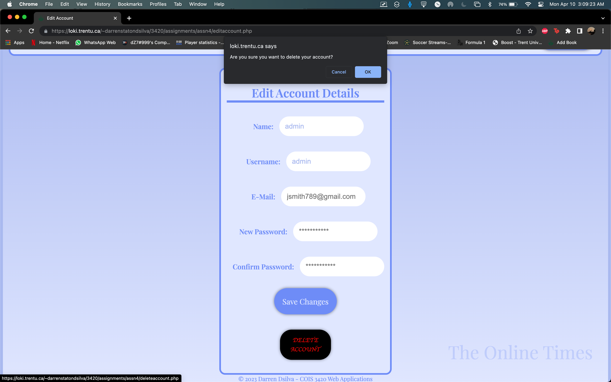
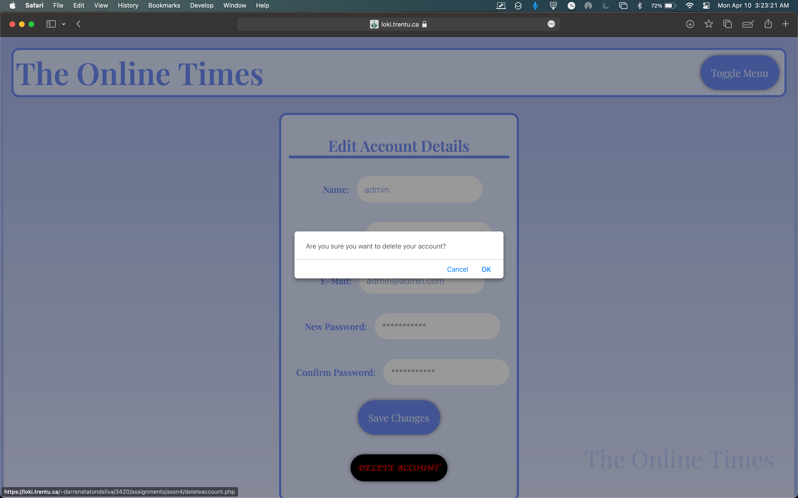

### Confirm Book Deletion
```js
//function to confirm deleting a book, to prevent from accidental deletion of a book
//this is done by displaying a window in the browser to confirm deletion.
//after deletion, it will delete the book from the database, and redirect the user to the index page.
const confirmDeleteBook = (bookid) => {
    if (confirm("This action will delete the book, and is not recoverable! Are you sure you want to delete this book?")) {
        window.location = "deletebook.php?bookid=" + bookid
    }
}
```
```html
        <?php foreach ($books as $book): ?>
        <div class="book">
           alt="Cover page of the Great Gatsby" height="220" width="200">
          <p><?=$book['title']?></p>
          <p><?=$book['author']?></p>
          <a onclick="displayBook(<?= $book['bookid'] ?>)">More Details</a>
          <a href=<?="./editbook.php?bookid=" . $book['bookid']?>>Edit Book</a>
          <a onclick="confirmDeleteBook(<?= $book['bookid'] ?>)">Delete Book</a>
```
#### Testing
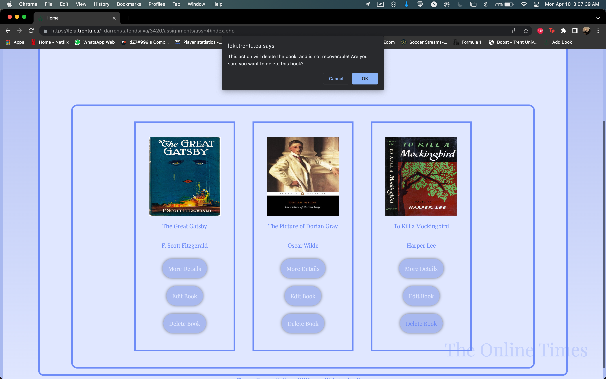
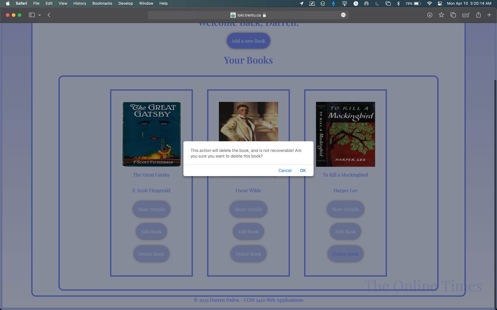

### Display Details
```js
// function to handle the controls for the modal
displayBook = (bookid) => {
    // get modal element using id
    modal = document.getElementById('modal' + bookid);
    // display modal
    modal.style.display = "block";

    // define the close button
    const close = document.getElementsByClassName("close")[0];

    // when the user clicks on the close button, it will close the modal
    close.onclick = () => {
        modal.style.display = "none";
    }

    // when the user clicks anywhere outside of the modal, it will close the modal
    window.onclick = (event) => {
        if (event.target == modal) {
            modal.style.display = "none";
        }
    }
}
```
```html
    <a onclick="displayBook(<?= $book['bookid'] ?>)">More Details</a>
```
#### Testing
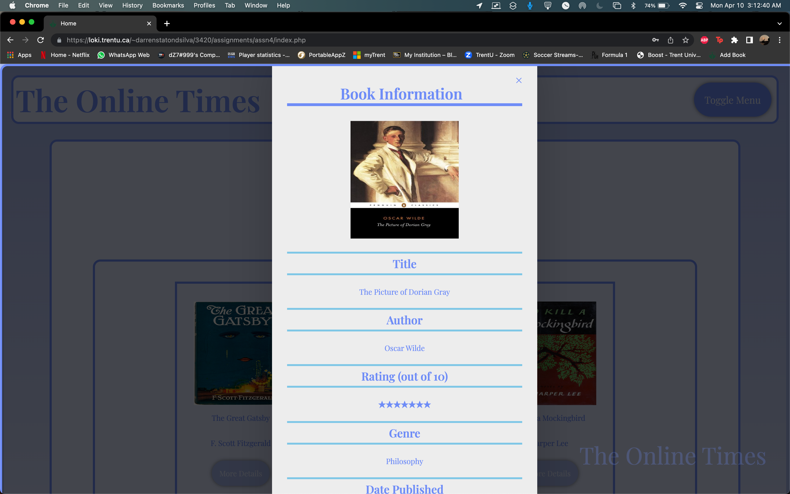
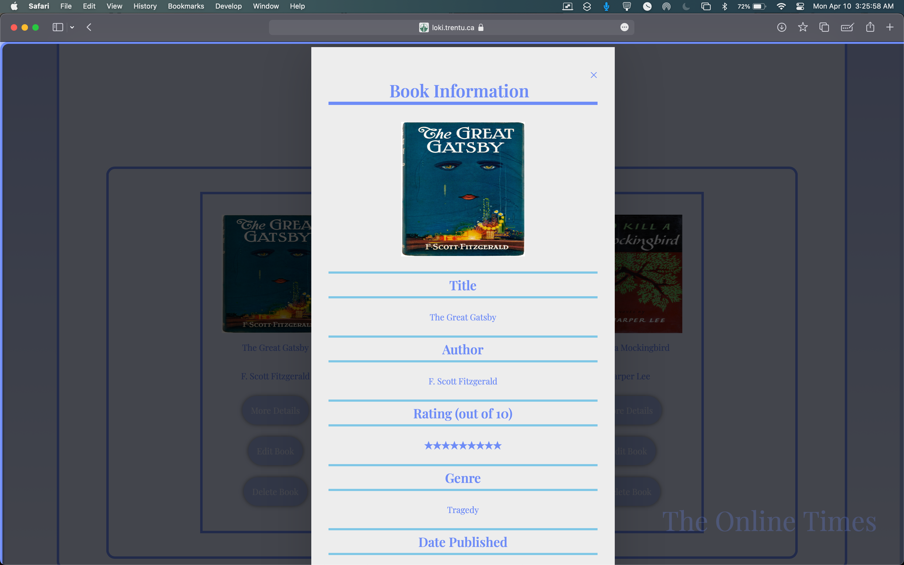

### Collapsible Nav
```js
// defines the toggleNav function to toggle the display of the nav
const nav = document.getElementById("nav");
const navButton = document.getElementById("togglenav");

let hidden = true;

nav.classList.add("hidden"); // add the hidden class to the nav

// add an event listener to the button
navButton.addEventListener("click", () => { 
    if (hidden) {
        // if the nav is not displayed, display it
        nav.classList.remove("hidden");
        hidden = false;
    } else {
        // if the nav is displayed, hide it
        nav.classList.add("hidden");
        hidden = true;
    }
});
```
```html
  <header>
    <h1>The Online Times</h1>
    <button id="togglenav" class="button">
		Toggle Menu
    </button>
      <nav id="nav">
        <ul>
          <li><a href="index.php"><i class="fa-solid fa-house"></i>&nbsp;Home</a></li>
          <li><a href="search.php"><i class="fa-solid fa-magnifying-glass"></i>&nbsp;Search</a></li>
          <li><a href="addbook.php"><i class="fa-solid fa-plus"></i><i class="fa-solid fa-book"></i>&nbsp;Add Book</a></li>
          <li><a href="editaccount.php"><i class="fa-regular fa-user"></i>&nbsp;<?php echo $results['name']?></a></li>
          <li><a href="logout.php"><i class="fa-solid fa-sign-out"></i>&nbsp;Logout</a></li>
        </ul>
      </nav>
  </header>
<?php }
if(!$signed) { ?>
  <header>
    <h1>The Online Times</h1>
    <button id="togglenav" class="button">
		Toggle Menu
    </button>
      <nav id="nav">
        <ul>
          <li><a href="index.php"><i class="fa-solid fa-house"></i>&nbsp;Home</a></li>
          <li><a href="login.php"><i class="fa-solid fa-right-to-bracket"></i>&nbsp;Login</a></li>
          <li><a href="register.php"><i class="fa-solid fa-user-plus"></i>&nbsp;Register</a></li>
        </ul>
      </nav>
  </header>
```
#### Testing
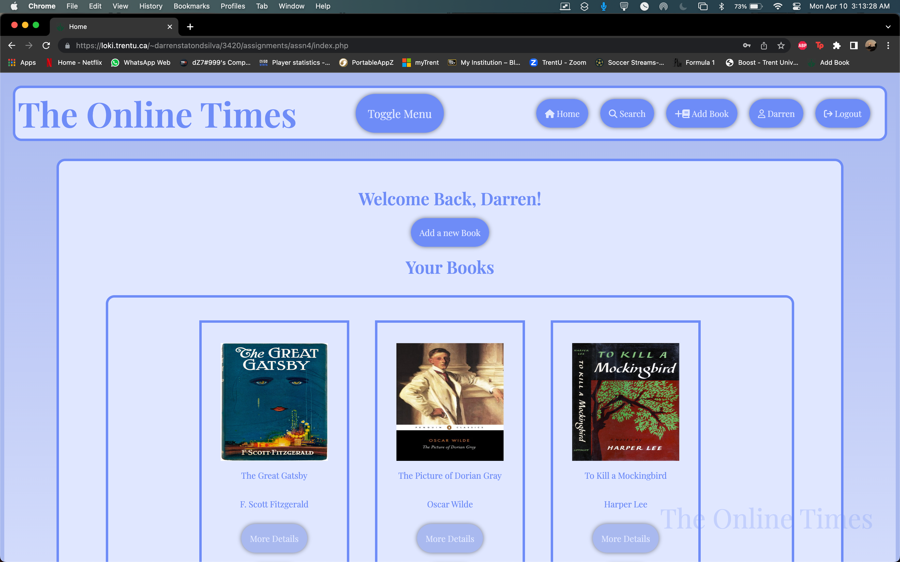


### Show Password
```js
// javascipt for password reveal
// it uses the font awesome eye icon to toggle between password and text by 
// changing the type attribute of the password input field
const togglePassword = document.querySelector("#togglePassword");
        const password = document.querySelector("#password");

        togglePassword.addEventListener("click", function () {
            // toggle the type attribute
            const type = password.getAttribute("type") === "password" ? "text" : "password";
            password.setAttribute("type", type);
            
            // toggle the icon
            this.classList.toggle("fa-eye");
        });

```
```html
        <div>
          <label for="password">Password:</label>
          <input type="password" placeholder="**********" name="password" id="password" minlength="3" maxlength="16" required/>
          <div><i class="fa-solid fa-eye-slash" id="togglePassword"></i></div>
        </div>
```
#### Testing

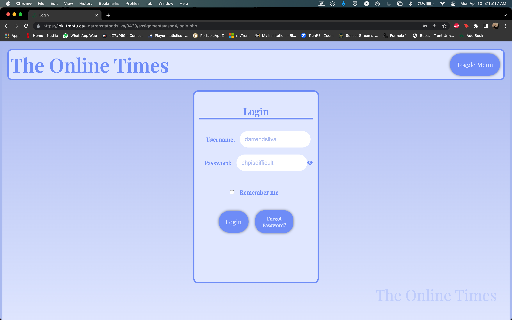
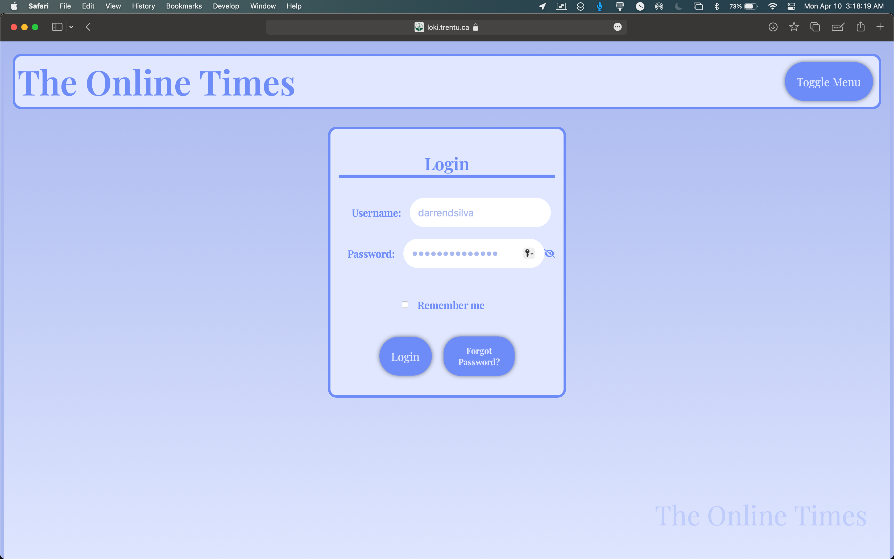


### Summary Limit
```js
//this is a javascript file that will display the characters remaining in the description field of the add book form
// defining the variables
let description = document.getElementById("description");
let count = document.getElementById("count");
const max = 2500; // maximum number of characters

const countCharacters = () => {
    let numberofchars = description.value.length; // number of characters in the description field
    let counter = max - numberofchars; // number of characters remaining
    count.textContent = counter + "/2500"; // display the number of characters remaining
};

description.addEventListener("input", countCharacters); // add an event listener to the description field
```
```html
            <div>
                <label for="description">Description: </label>
                <textarea name="description" id="description" maxlength="2500" cols="25" rows="10"></textarea>
            </div>
            <span id="count">2500/2500</span>
```
#### Testing
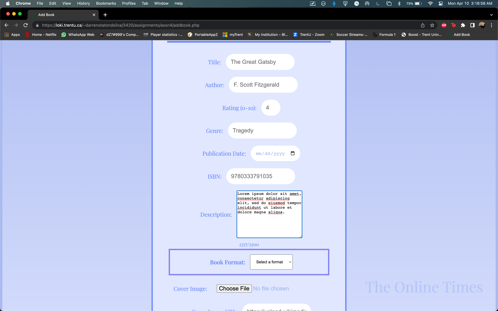
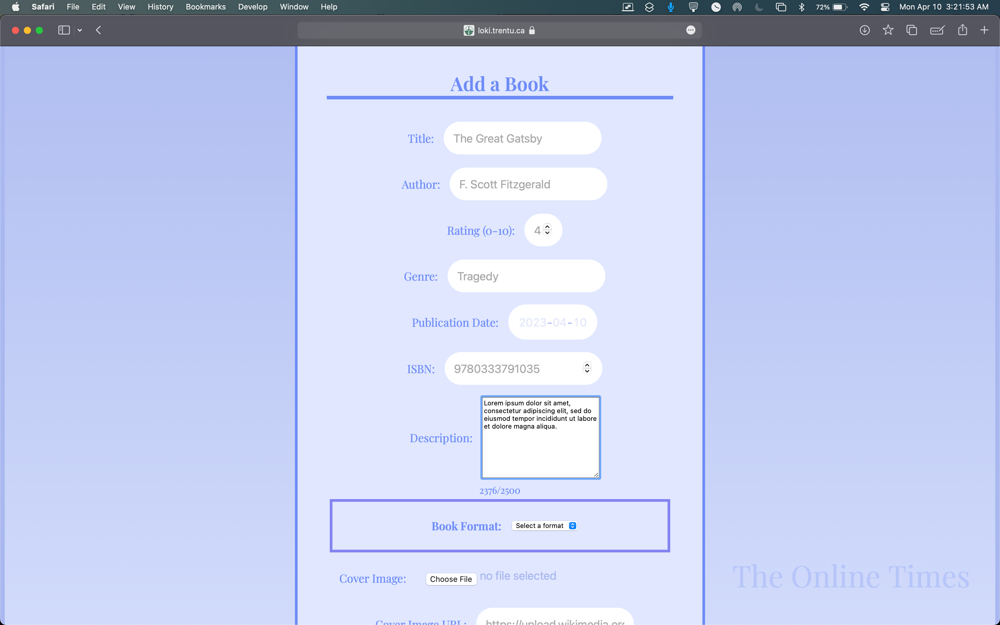

